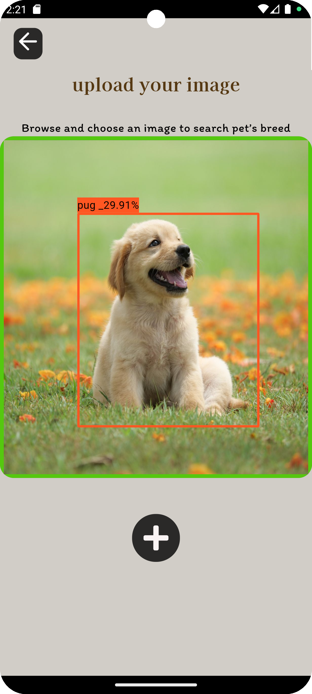

<div align="center">
  
</div>

<h1 align="center">PetBrew-Identifier-PyTorch-Flutter</h1>

<h2 align="center">Overview</h2>

PetBrew-Identifier-PyTorch-Flutter is a project aimed at pet breed identification using object detection techniques. This repository contains code for training and deploying a PyTorch-based model for identifying various pet breeds on the Oxford-IIIT Pet dataset. The project also includes a Flutter-based mobile application for real-time breed identification using the trained model.

The model can detect pet breeds in real-time using a device's camera or on images from the device's gallery. Importantly, it runs natively on the device, eliminating the need for server-side processing for breed detection.

<h2 align="center">Links</h2>

| Description           | Link                                                                                   |
|-----------------------|----------------------------------------------------------------------------------------|
| Dataset               | [Oxford-IIIT Pet dataset](https://universe.roboflow.com/first-qkz37/pet-zvxwi/dataset/1) |
| Base Model            | [Ultralytics YOLOv8n](https://github.com/ultralytics/assets/releases/download/v8.2.0/yolov8n.pt) |
| Download Pre-trained Model | [Pre-trained Model](/path/to/pretrained/model)                                        |
| Test Model            | [Ultralytics Model Hub](https://hub.ultralytics.com/models/mFTiXSBNCp3LS4MjtCEL)        |

<h2 align="center">Features</h2>

- Real-time pet breed identification using device camera
- Pet breed identification on images from device gallery
- Native deployment without reliance on server-side processing
- Easy-to-use Flutter-based mobile application interface

<h2 align="center">Installation</h2>

1. Clone this repository:

```
git clone https://github.com/ThongNguyenDT/PetBrew-Identifier-PyTorch-Flutter.git
```

2. Install dependencies for  Flutter as specified in the respective `pubspec.yaml` files.

```
flutter pub get
```


<h2 align="center">Usage</h2>

### Training

Update soon

### Mobile Application

1. Open the Flutter project in your preferred IDE.
2. Build and run the project on your device or emulator.

### Real-time Detection

1. Launch the Flutter application.
2. Use the device camera for real-time pet breed identification.

### Image Gallery Detection

1. Launch the Flutter application.
2. Select an image from the device gallery for pet breed identification.

<h2 align="center">Screenshots</h2>

| <br/>Gallery Screen | <br/>Camera Screen |
|:------------------------------------------------------------------------------------------------------------------:|:------------------------------------------------------------------------------------------------------------------:|


<h2 align="center">Contributing</h2>

Update soon

## License

This project is licensed under the MIT License - see the [LICENSE](LICENSE) file for details.

---

Feel free to customize this README according to your project's specifics. Let me know if you need further assistance!